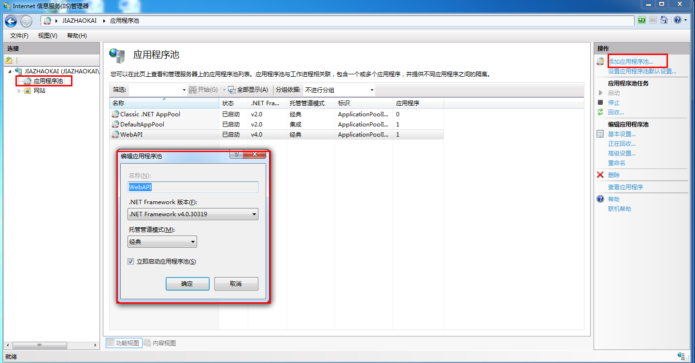
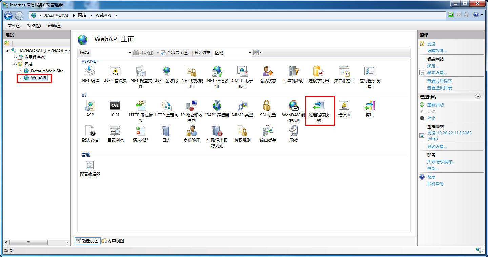
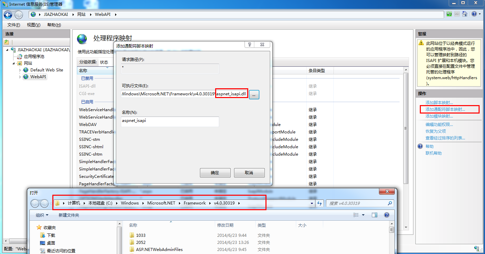
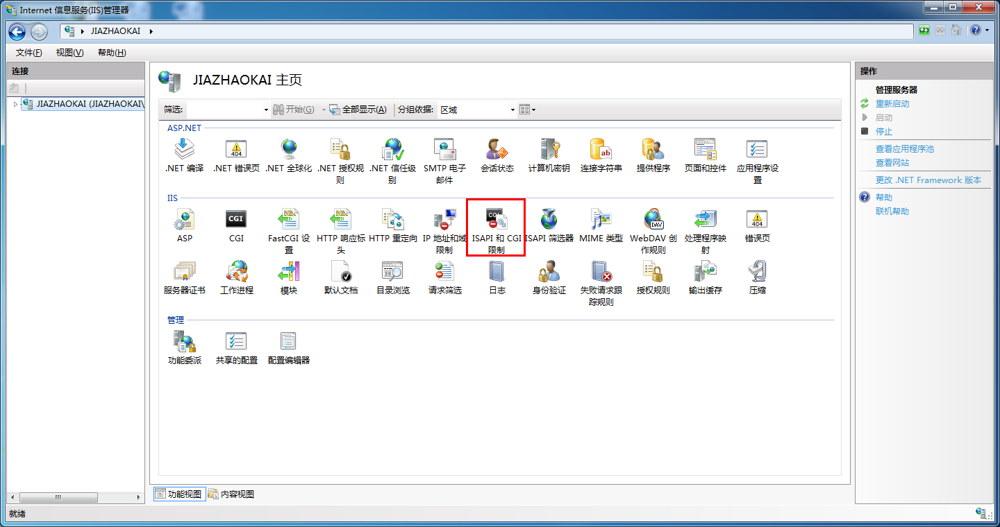
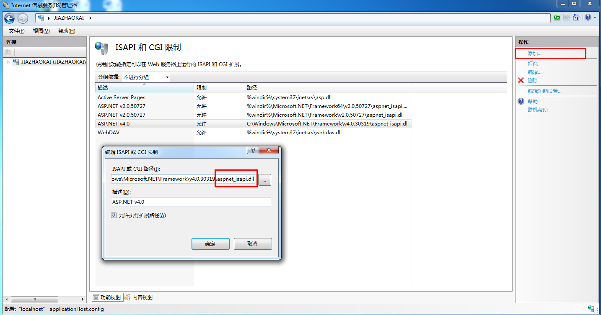
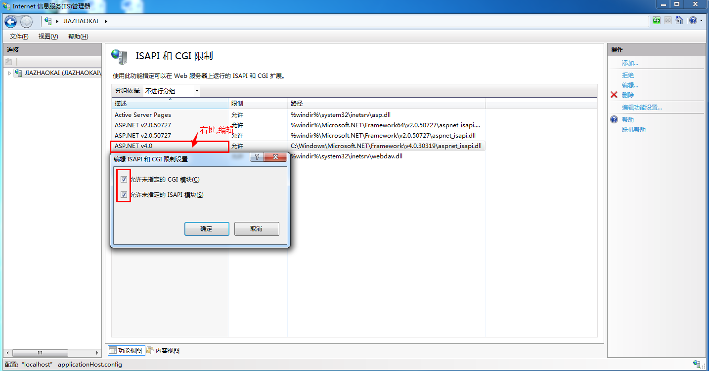

1.添加应用程序池

2.处理程序映射，

3.添加通配符脚本映射，路径等同应用程序池ASP.NET版本下的，ASPNET_ISAPI.DLL，路径：C:\Windows\Microsoft.NET\Framework\v4.0.30319\aspnet_isapi.dll

4.翻到IIS根目录，设置【ISAPI和CGI限制】。

5.添加【ISAPI和CGI限制】，路径等同上面所选的 aspnet_isapi.dll文件。

6.编辑刚添加的【isapi和CGI】，给定两个权限。

可能遇到的问题以及解决办法：

CS0016: 未能写入输出文件“c:\WINDOWS\Microsoft.NET\Framework\.。。”--“拒绝访问

将windows/temp属性-安全-高级 添加IIS_USERS用户，同时编辑权限为完全控制(写入和编辑)即可。

注意: 要确保权限添加上了，win7下有可能系统为安全，会自动取消你所做的权限设置。先管理员取得所有权，然后在添加。

 

如有问题，请留言探讨。谢谢！

欢迎共通进步，最近在研究 ASP.NET MVC 和 ASP.NET WEB API，WEB API为android app等平台提供数据接口。

