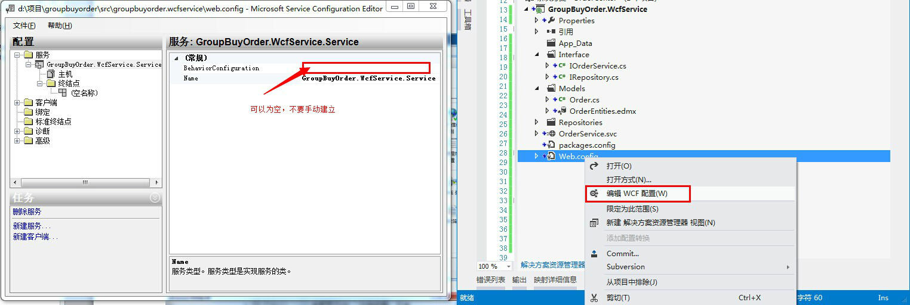
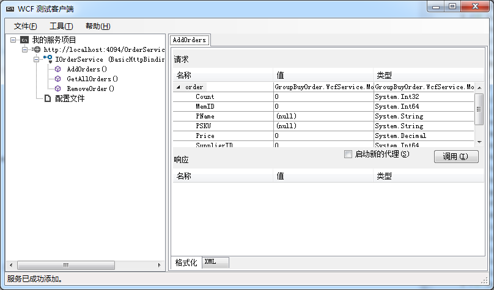
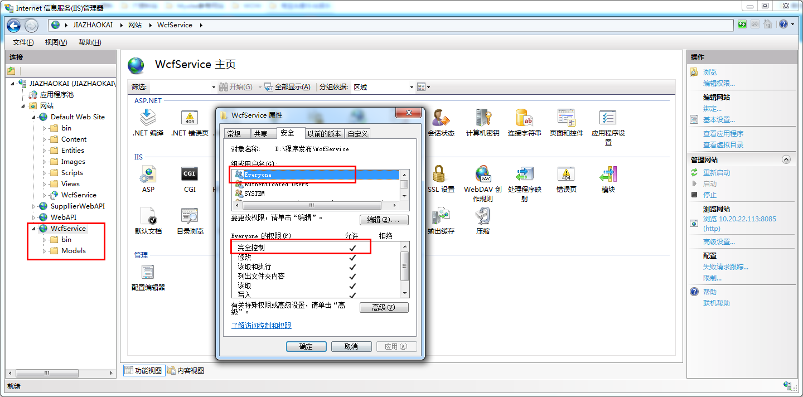
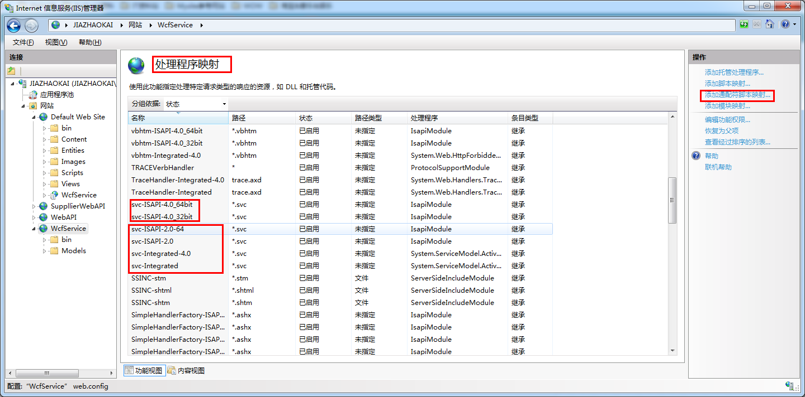
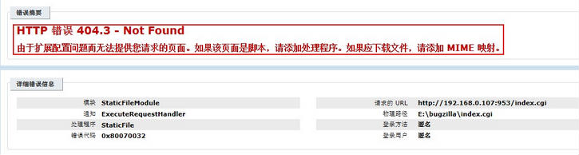

正常新建WCF服务。

配置Web.config 或者 app.config，

F5，调试能跑起来，没问题的话。如下图：

二，开始准备IIS发布 WCF服务的工作。

发布方式类似正常情况的网站发布，也就是文件系统发布。

发布成功之后，先调权限问题。

配置处理程序映射，查找 svc开头的，

如果不存在，则会报错：（以下是错误内容和解决办法）

对应你的系统所用的如果是 .NET Framework 4.0以下版本，则要看后缀为2.0那几项是否存在。

此错误的解决办法：

以管理员的身份运行“cmd.exe”，运行“cd 系统盘:\Windows\Microsoft.NET\Framework\v3.0\WindowsCommunication Foundation”，再输入“ServiceModelReg.exe  -i”。再查看“处理程序映射”，里面就有红框内的内容了，再“浏览”“Service.svc”就OK了。

而.NET Framework 4.0以上的版本，则要看后缀为4.0的那几项是否存在。

1
HTTP 错误 500.21 - Internal Server Error处理程序“PageHandlerFactory-Integrated”在其模块列表中有一个错误模块“ManagedPipelineHandler”
原因：在安装Framework v4.0之后，再启用IIS，导致Framework没有完全安装

解决：开始->所有程序->附件->鼠标右键点击“命令提示符”->以管理员身份运行->%windir%\Microsoft.NET\Framework\v4.0.30319\aspnet_regiis.exe-i

如果还不行，可检查IIS的应用程序池，是否使用集成模式，如果不是则改成集成模式

最后，切换到内容视图，浏览  service.svc 文件。

如果还不行，你来打我吧。

欢迎共通进步，最近在研究 ASP.NET MVC 和 ASP.NET WEB API，WEB API为android app等平台提供数据接口。

关注个人博客。

在IIS8添加WCF服务

1. 首先添加MIME类型 扩展名“.svc”，MIME类型 “application/octet-stream”

2. 然后在“Handler Mappings”中添加Managed Handler，

Request path: *.svc

Type: System.ServiceModel.Activation.HttpHandler

Name: svc-Integrated

